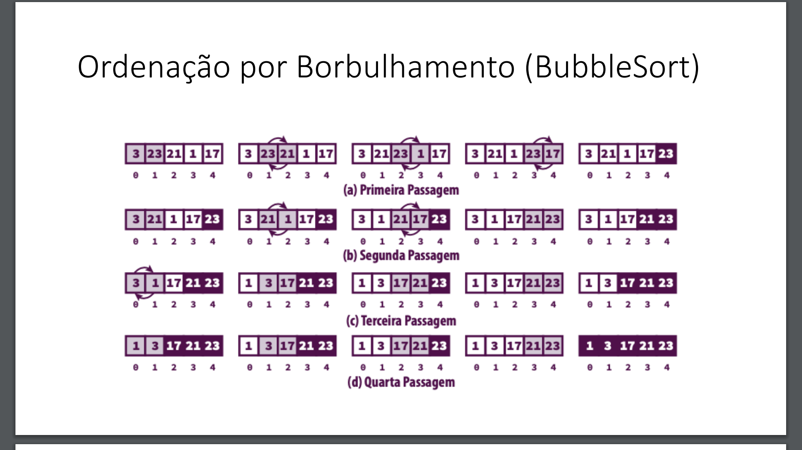
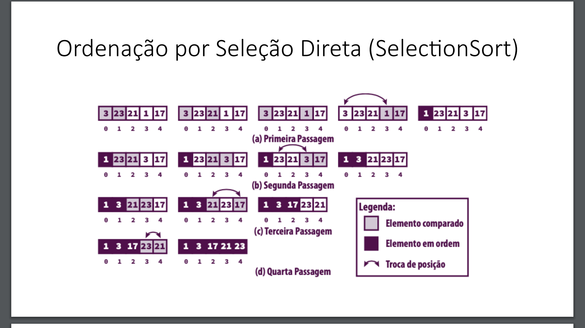
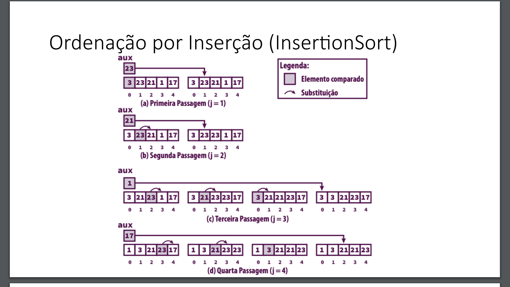

# Python-AlgoritmosDeOrdenacao-1
Este projeto consiste em uma implementação em Python de três algoritmos de ordenação com Custo Temporal Quadrático: Bubble Sort, Selection Sort e Insertion Sort. O objetivo principal é demonstrar a aplicação desses algoritmos na ordenação de arrays e comparar seus desempenhos em termos de tempo de execução.

## Algoritmos de Ordenação Implementados

1. **Bubble Sort:** Um algoritmo simples que compara pares de elementos adjacentes e os troca se estiverem na ordem errada. Repete esse processo até que o array esteja ordenado.

2. **Selection Sort:** Este algoritmo divide o array em duas partes: uma parte ordenada e outra desordenada. Ele encontra o menor elemento na parte desordenada e o move para o início da parte ordenada.

3. **Insertion Sort:** Este algoritmo percorre o array e, para cada elemento, o insere na posição correta na parte já ordenada do array, deslocando os elementos maiores conforme necessário.

